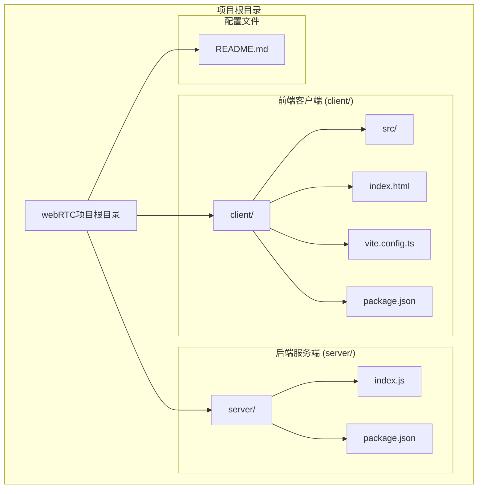
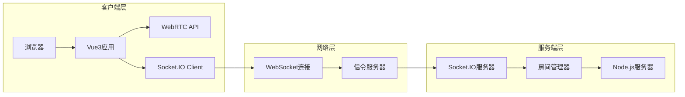
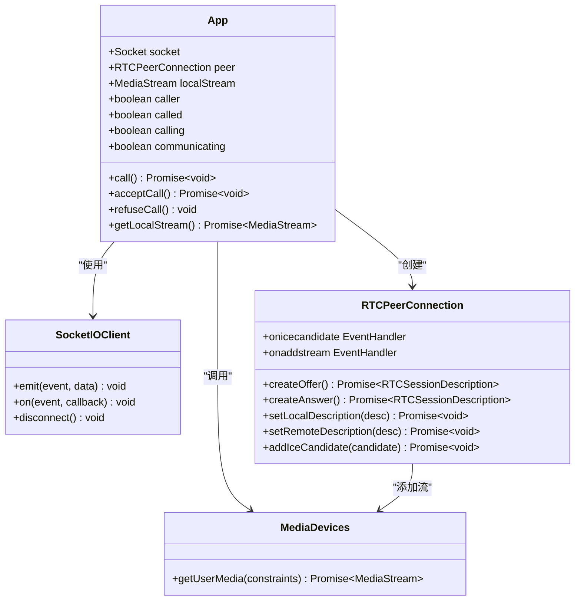
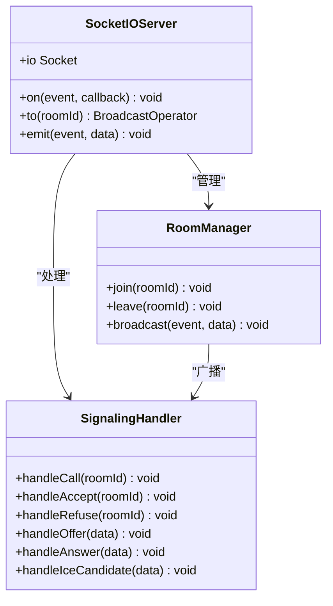
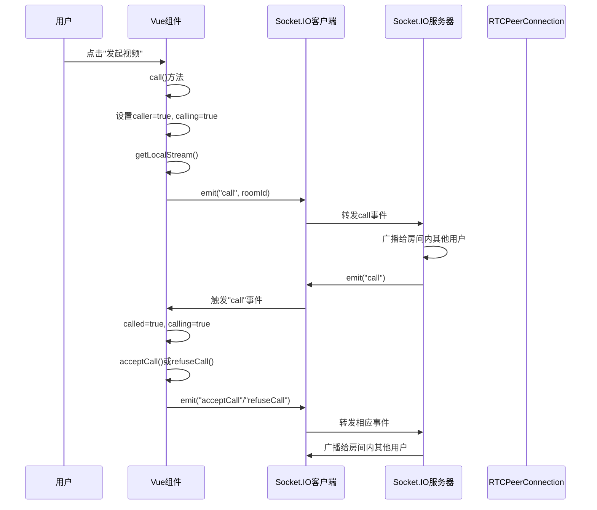
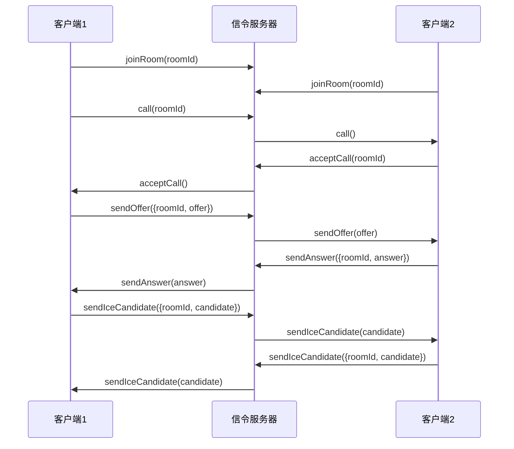

## 项目说明

这是一个基于 Vue3 和 TypeScript 构建的实时视频通信应用，采用现代前端技术栈实现 WebRTC 视频通话功能。项目通过 Socket.IO 实现实时通信，支持一对一视频通话，具备完整的呼叫流程控制和 WebRTC 信令交换机制。

### 目录结构概览

该项目采用典型的前后端分离架构设计，通过清晰的目录结构实现了客户端和服务端的独立开发和部署。整个项目包含四个主要目录：



### 整体架构图



### 客户端 Client

```bash
npm i
npm run dev
```

#### 客户端核心组件



### 服务端 Server

```bash
npm i
npm run start
```

#### 服务端核心组件



### 用户操作到 Socket 事件的转化流程



## 信令交换机制



## 参考

[peer.js](https://peerjs.com/)
